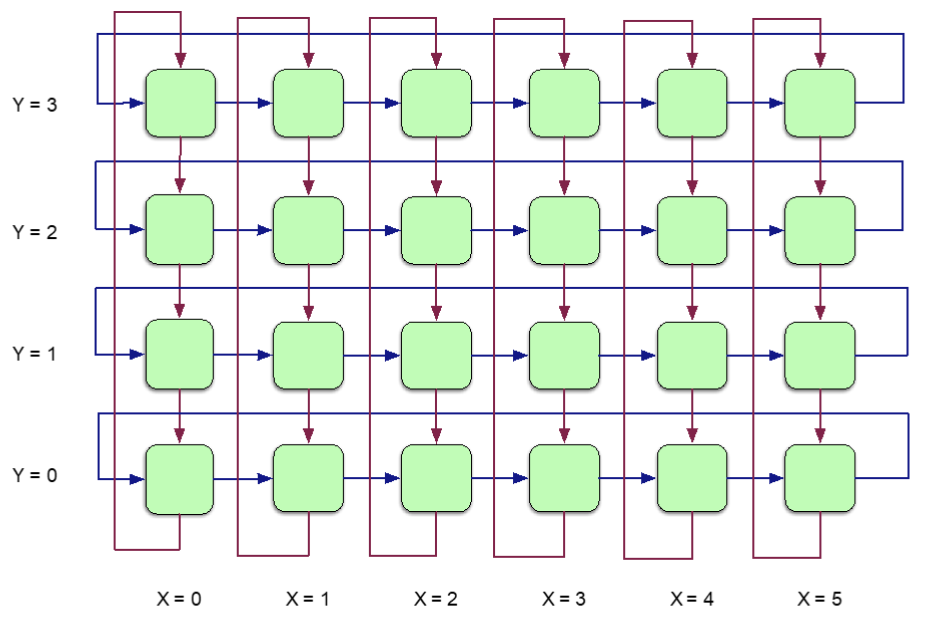

# Introduction to Data Movement in TT-Metal

## Overview

The **Data Movement** directory in TT-Metal is dedicated to the design, testing, and analysis of data transfer mechanisms within Tenstorrent AI hardware. At the heart of this system is the **Network-On-Chip (NOC)**, a high-bandwidth, scalable interconnect that enables efficient communication between Tensix cores and other subsystems such as DRAM and PCIe. The NOC is orchestrated by two RISCV processors (BRISC and NCRISC), and supports both software-initiated and hardware-initiated data transfers.

---

## NOC Architecture and Features

- **Dual NOC Instances:**
  Two independent NOC instances (NOC0 & NOC1), each driven by a dedicated RISCV processor, provide redundancy and increased bandwidth.

- **Torus Topology:**
  Routers are arranged in a 2D torus (ring/donut) topology, with folding to ensure uniform latency between nodes.

  

- **Packet-Switched Network:**
  Data is transmitted in packets, with a maximum packet size of 8KB (Wormhole) or 16KB (Blackhole). Each packet is subdivided into flits (flow control units).

- **Interface Width:**
  - Wormhole: 256 bits/cycle (32 bytes/cycle)
  - Blackhole: 512 bits/cycle (64 bytes/cycle)

- **Supported Operations:**
  Read, write, and atomic operations are supported for flexible data movement.

- **Virtual Channels:**
  16 virtual channels per NOC instance for efficient traffic management.

- **Evolution across Architectures:**
  The NOC features, architecture, and design in Wormhole and Blackhole SOCs are almost identical except for some minor differences.

---

## Purpose and Organization of the Data Movement Directory

The `data_movement` directory serves as the central hub for:

### 1. Comprehensive Test Coverage

- Implements a wide range of tests covering various data movement scenarios:
  - DRAM-to-core
  - Core-to-core
  - Multiple core-to-core
  - Multicast
  - Loopback
  - And more
- Each test is assigned a unique test ID and is documented in the corresponding README files.

### 2. Performance Measurement and Profiling

- Measures and analyzes key metrics such as **latency** and **bandwidth** for each data movement pattern.
- Utilizes profiling tools and scripts (e.g., `test_data_movement.py`) to gather, process, and visualize results.
- Enables identification of bottlenecks and opportunities for optimization.

### 3. Regression and Validation

- Ensures that data movement kernels meet expected performance and correctness criteria.
- Includes assertions and logging to detect regressions or unexpected results.
- Facilitates continuous integration and robust development practices.

### 4. Documentation and Knowledge Sharing

- Provides clear, structured documentation for each test case, including:
  - Test flow and methodology
  - Parameters and configurations
  - Expected outcomes and performance targets
- Each subdirectory (e.g., `one_to_one`, `one_from_all`, `loopback`) contains a `README.md` with scenario-specific details.

### 5. Extensibility and Ease of Contribution

- Designed to make it straightforward to add new data movement tests.
- Follows a documented process for test creation and integration.
- Encourages contributions and collaboration from the community.

---

## Getting Started

To get started with data movement testing and profiling:

1. **Explore the Test Suites:**
   Review the available tests and their documentation in each subdirectory.

2. **Run and Analyze Tests:**
   Use the provided scripts to execute tests and analyze performance metrics.

3. **Add New Tests:**
   Follow the guidelines in the main `README.md` to contribute new scenarios or improve existing ones.

4. **Consult Documentation:**
   Refer to this document and subdirectory READMEs for architectural details, test descriptions, and usage instructions.

---

## References

- [Main README.md](https://github.com/tenstorrent/tt-metal/tree/main/tests/tt_metal/tt_metal/data_movement/README.md)
- [Test Data Movement Script](https://github.com/tenstorrent/tt-metal/tree/main/tests/tt_metal/tt_metal/data_movement/python/test_data_movement.py)
- [TT-Metalium Tech Reports](https://github.com/tenstorrent/tt-metal/tree/main/tech_reports/)

---

*For further questions or contributions, please refer to the project’s [CONTRIBUTING.md](https://github.com/tenstorrent/tt-metal/tree/main/CONTRIBUTING.md).*
