Multicast Schemes
=================

## Summary

We evaluated how multicast write parameters impact throughput (bytes per cycle) on Wormhole (WH) and Blackhole (BH). Across scheme placements, NoC selection, and loopback settings, performance is primarily governed by whether the write-acknowledge traffic is forced to traverse the same congested links as the multicast writes. When the acknowledge path shares the congested route, bandwidth degrades sharply with grid size. Removing loopback for inside-the-grid cases slightly improves performance.

## Background

Multicast writes can be parameterized by NoC selection, sender placement relative to the destination grid, and whether loopback is enabled. The interaction of these parameters determines contention on the physical NoC links. Although writes and acknowledges use different virtual channels (VCs), they share the same physical links; thus, VC selection alone does not remove the underlying link contention.

## Methodology

- Metric: bytes per cycle (throughput)
- Platforms: Wormhole (WH) and Blackhole (BH)
- NoC: 0 and 1
- Loopback: enabled vs. disabled
- Grid dimensions (m × m): WH 2–7; BH 2–9
- Schemes (sender position relative to the grid):

| Sender Inside Grid (1–4)               | Sender Outside Grid, Bottom-Left Corner (5–7) | Sender Outside Grid, Top-Right Corner (8–10) |
|----------------------------------------|-----------------------------------------------|----------------------------------------------|
| 1: Top-right corner                    | 5: Shared row with grid                       | 8: Shared row with grid                      |
| 2: Bottom-right corner                 | 6: Shared column with grid                    | 9: Shared column with grid                   |
| 3: Bottom-left corner                  | 7: Neither row nor column shared with grid    | 10: Neither row nor column shared with grid  |
| 4: Top-left corner                     |                                               |                                              |

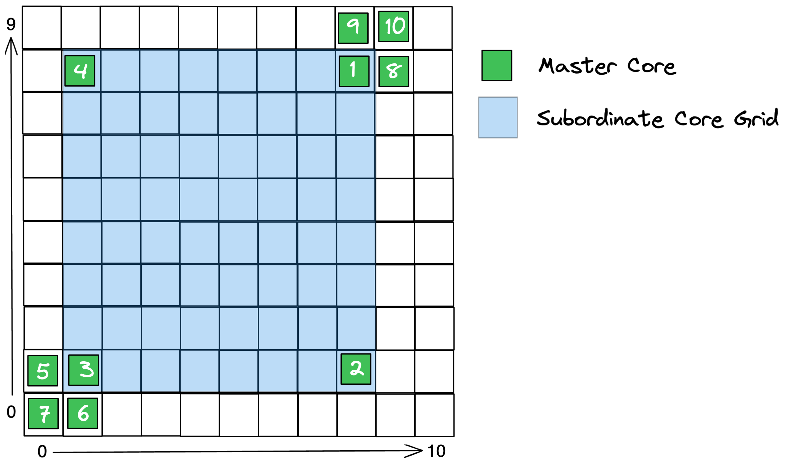

## Results

### Wormhole

| Test type         | Plot |
|-------------------|------|
| Loopback enabled  | 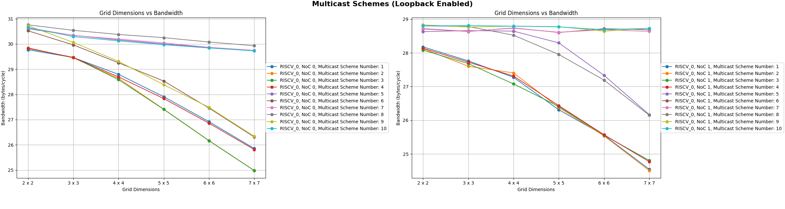 |
| Loopback disabled | 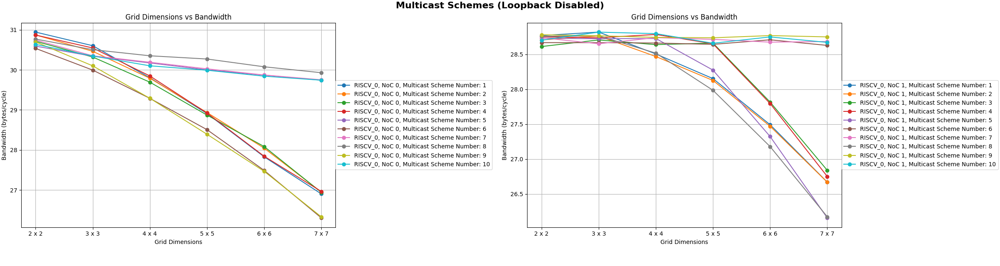 |

### Blackhole

| Test type         | Plot |
|-------------------|------|
| Loopback enabled  | 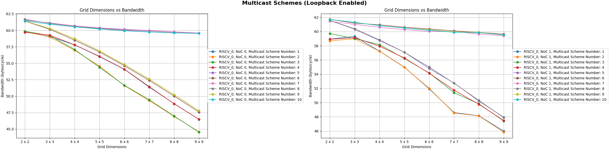 |
| Loopback disabled | 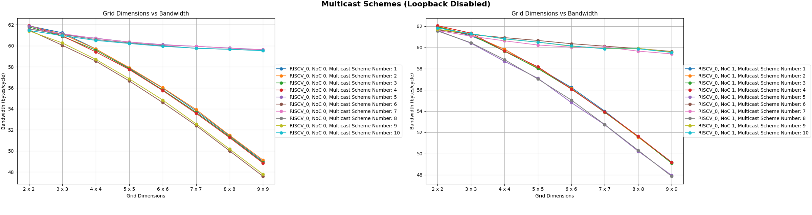 |

### Per-result callouts

- Inside-the-grid (schemes 1–4): Slightly higher performance when loopback is disabled.
- Outside-the-grid with shared geometry:
  - NoC 0: Column-shared placements (6, 9) show noticeable drops.
  - NoC 1: Row-shared placements (5, 8) show noticeable drops.
- Outside-the-grid with neither row nor column shared (7, 10): More resilient as grid size increases.

## Discussion and root cause

The disproportionate bandwidth loss occurs when the acknowledge path must traverse the same congested links as the multicast writes. Even though multicast writes and acknowledges are assigned different VCs, contention is determined by the physical links; VCs do not add capacity on a busy link. This effect is scheme- and NoC-dependent:

- On NoC 0, routes emphasize column sharing; on NoC 1, routes emphasize row sharing. Consequently, the worst cases differ by NoC.
- As the subordinate grid grows, more traffic converges on shared links. If the acknowledge path also uses those links, the system experiences self-interference: a congested write path delays acknowledges, which in turn restricts forward progress, compounding the bottleneck.

The diagrams below visualize write paths versus acknowledge paths for representative outside-the-grid cases (schemes 5 and 6) on NoC 0 and NoC 1. The left column shows cases where the congested path is not shared; the right column shows cases where it is shared by both writes and acknowledges.

|       | Congested path is not shared by both multicast writes and acknowledges     | Congested path is shared by both multicast writes and acknowledges          |
|-------|----------------------------------------------------------------------------|----------------------------------------------------------------------------|
| NoC 0 | Scheme 5                                                                    | Scheme 6                                                                  |
|       | 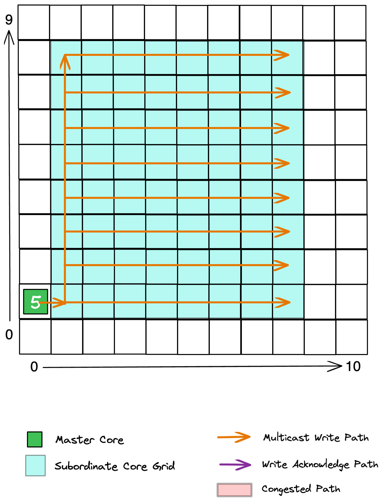 | 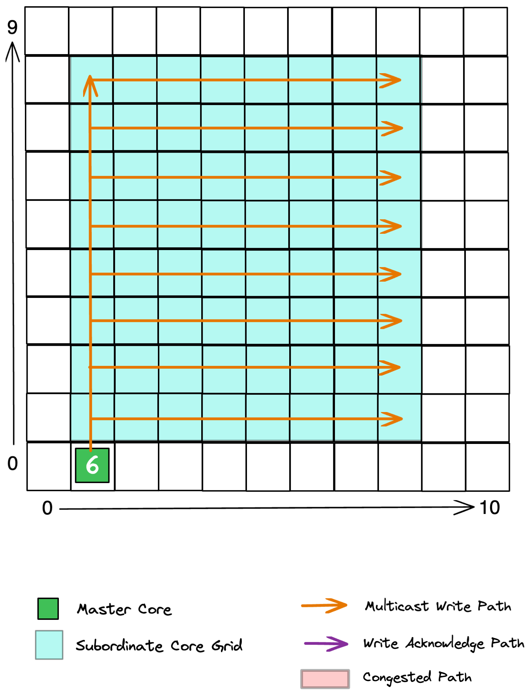 |
|       | 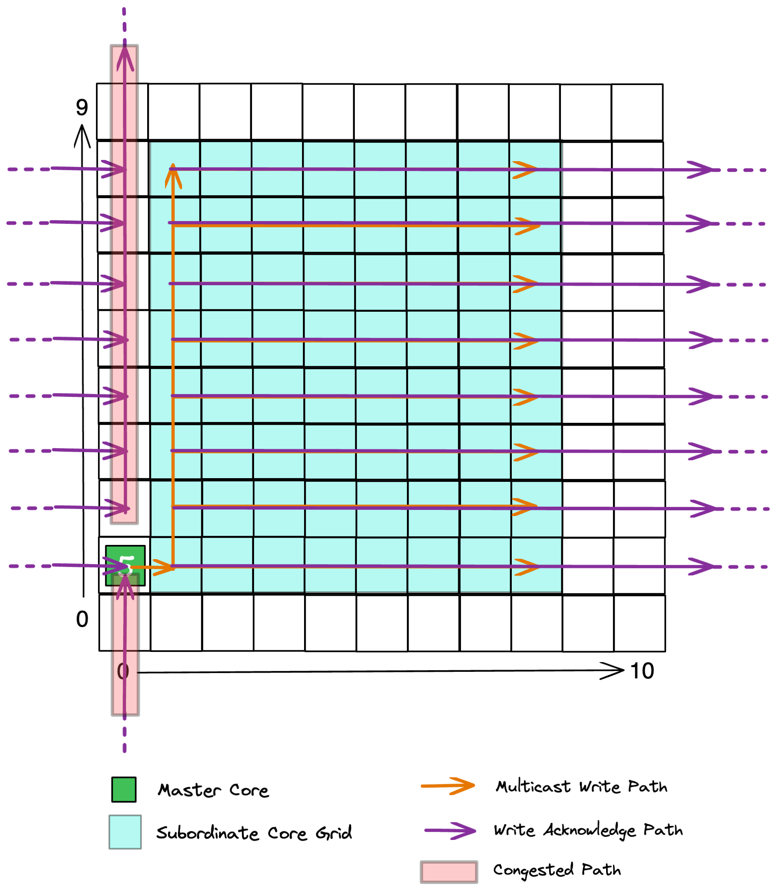       | 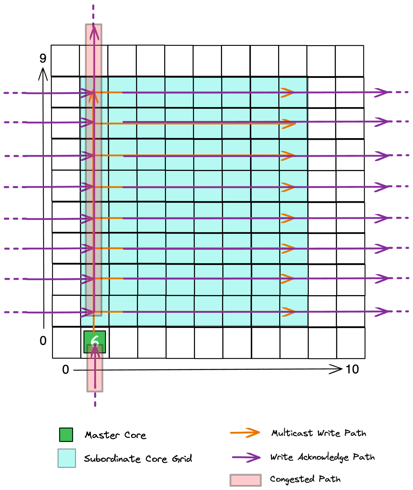       |
| NoC 1 | Scheme 6                                                                    | Scheme 5                                                                  |
|       | 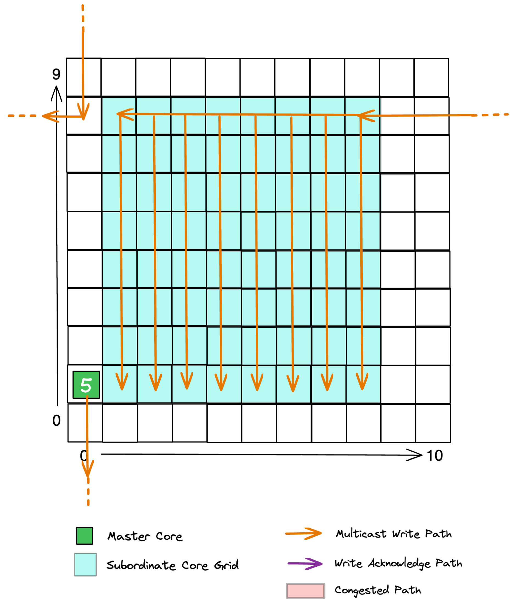 | 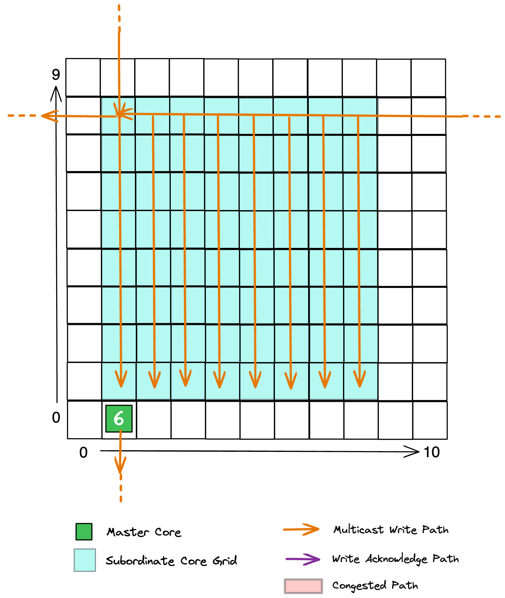 |
|       | 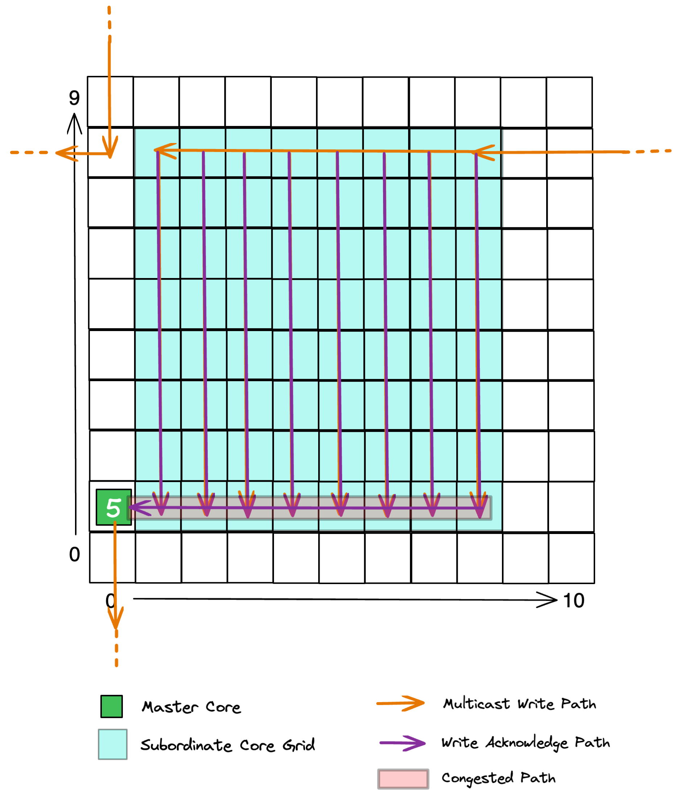       | 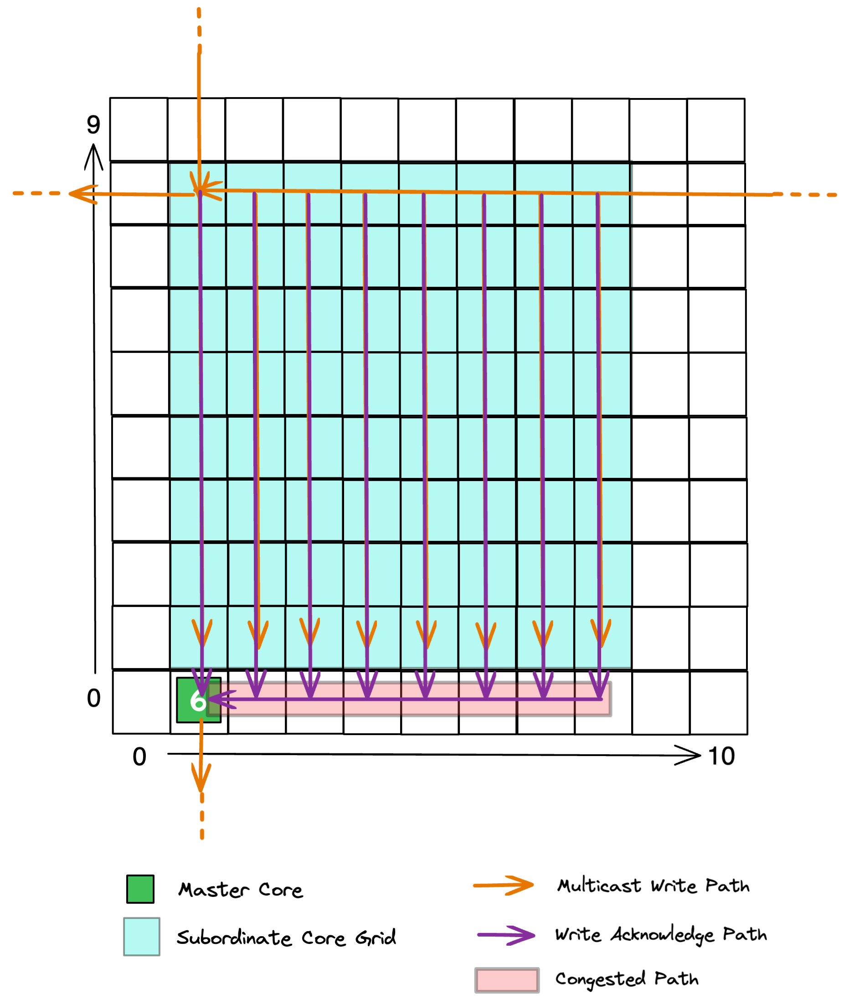       |

## Recommendations

- Prefer placements that avoid sharing the congested write path with the acknowledge path:
  - NoC 0: Avoid column-shared placements (6, 9) when possible
  - NoC 1: Avoid row-shared placements (5, 8) when possible
[//]: # (- For inside-the-grid senders (1–4), favor configurations without loopback if correctness and programming model permit. NOTE: Not sure whether to include this or not since loopback is always advised when doing multicast writes)
[//]: # (- Treat VC selection as orthogonal: do not expect VC changes to rescue throughput when the physical path is saturated. NOTE: Not sure if this note is worth including at all)
