## Motivation

The motivation of this document is to explain the benefits that transaction IDs can provide when writing kernels.   
In the following text, we will use the term trid(trids for plural). 

## Common data movement patterns

Throughout metal, we have a few data movement kernel patterns that occur most frequently.  
When discussing a specific optimization we want to make/utilize, we have to be precise about which kernel type we are referring to. This is because those kernels behave very differently and have different bottlenecks that we can utilize.

1.   
```cpp
   for {  
        noc_api_call(); 
   }  
   noc_barrier();
```
2. 
```cpp
for{  
    cb_reserve_back() / cb_wait_front();
    noc_api_call();
    noc_barrier();
    cb_push_back() / cb_pop_front();
}
```
     
3. 
```cpp
for {  
    cb_reserve_back() / cb_wait_front();
    for {
        noc_api_call();
    }
    noc_barrier();
    cb_push_back() / cb_pop_front();
}
```

These 3 are the main and most common kernel types. There are, of course, a lot more, but let’s focus on these for now.

## The basics

The main idea is that we want the NoC to be utilized 100% of the time (ideally). To accomplish this, we must not have a moment where we don’t have outgoing NoC transactions.

#### Single Buffer

If we have a buffer with a space of 1, 50 % of the time we are receiving data, and 50% of the time we are processing that data. Our NoC BW will look like this (assuming that getting the data and processing the data take a similar amount of time).

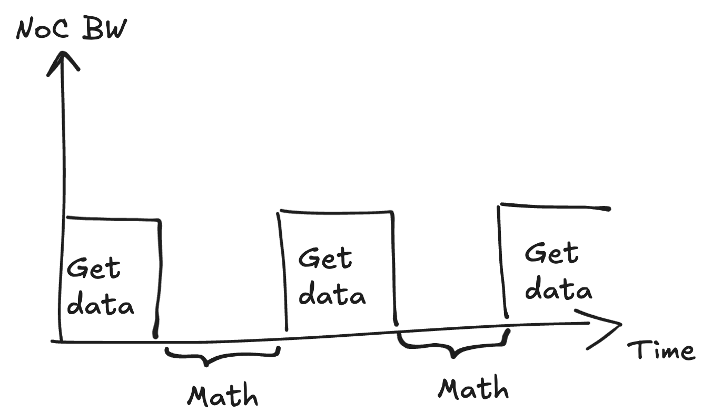

This is because the buffer will have one of two states at any given point in time:

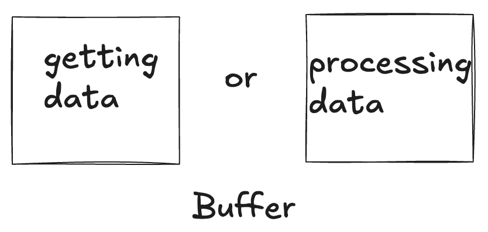

#### Double Buffer

If we have a buffer with two spaces, while the math is processing one part of the buffer, we can get the data for the other part of the buffer.

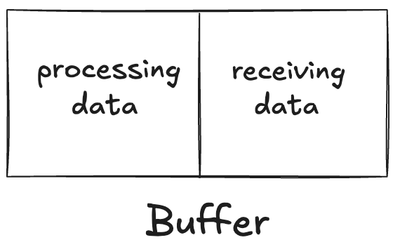

Let's now look at this example:  
If the math finishes first, this will be our buffer:

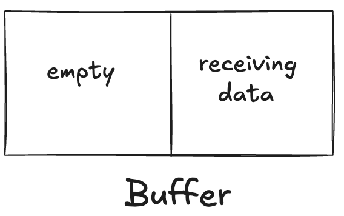

Now, if we issue a new transaction before the previous one has finished, we will have to wait for both of them using noc\_async\_read\_barrier().

If we use transaction IDs, we can wait on specific transactions. This way, we don’t have to wait for both transactions.

## Transaction size

In NoC, the transaction sizes have a huge impact.  
For example, if you have a transaction size of \>4096KB, we can expect the NoC BW to look something like this:

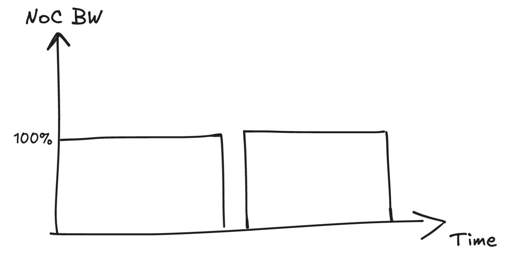

The time spent issuing the next transaction is "negligible" compared to the amount of time the NoC was being utilized. The middle part, where the NoC is not being utilized, represents the moment in time when the firmware issues a new transaction after it waits for the previous one to complete.

However, if we have smaller transactions, which is the real-world scenario, your NoC utilization will look like this:


The time spent issuing a NoC transaction is significant compared to the time spent on the transaction itself.

We can use 2 transaction IDs here, and double buffer to try to hide some of the noc issue time. However, if the transaction size is small, your bw is limited by the noc issue time.

## Transaction IDs 

Transaction IDs are bits stored inside the NoC packet used to identify them. This gives us an option to wait for specific packets instead of having to wait for all of them (noc\_async\_(read/write)\_barrier). 

Let’s look at the code example 3\. 

It is essential to note that the following conclusions are 100% correct only for code example 3\. The plots shown are generated on those types of kernels; thus, they should be considered only in that specific case.

In example 3, we constantly issue transactions one by one and wait for them.  
When the transaction finishes, we waste quite a bit of time before we issue the next transaction.

Instead, we can do the following:

```cpp
cb_reserve_back(cb,num_of_trids);
base_addr = get_write_ptr(cb);
for(i in range num_of_trids):
   noc_async_read_set_trid(i)
   noc_async_read(dst_addr, base_addr + i * page_size)

curr_trid = 0
for(i in range num_of_transactions):
   noc_read_barrier_with_trid(curr_trid)
   cb_push_back(cb, 1)
   if(i < num_of_transactions - num_of_trids):
       cb_reserve_back(cb, 1)
       write_addr = get_write_ptr(cb)
       noc_async_read_set_trid(curr_trid)
       noc_async_read(dst_addr, write_addr)
   curr_trid = (curr_trid + 1) % num_of_trids
```

The main difference here is that now the transaction has more time to arrive before we start waiting for it on the barrier. This way, we will spend less time waiting at the barrier, thus saving time.

Let’s now take a look at an example from the real kernel.
```cpp
for (uint32_t e = 0; e < num_local_experts; ++e) {  
    const auto & expert_idx = local_experts_ptr[e];  
    if (find_if<uint16_t, selected_experts_k, false>(metadata_ptr, expert_idx)) {  
        const uint32_t data_page_idx =  
            detail::get_data_page_idx<batch_size, seq_size, locally_reduced>(e, token);  
        cb_reserve_back(data_cb_id, 1);

        const uint32_t data_l1_addr=get_write_ptr(data_cb_id);  
        const uint64_t data_noc_addr = get_noc_addr(data_page_idx, data_addrgen);  
        noc_async_read(data_noc_addr,data_l1_addr,data_size_bytes);  
        noc_async_read_barrier();

        cb_push_back(data_cb_id, 1);

        if constexpr (locally_reduced){  
            break;  
        }  
    }  
}
```

Here, we issue a read transaction, wait for the data to arrive, and then, when the data has arrived, we push it into the circular buffer. 

We are wasting a bunch of cycles during which the noc is not being utilized. Instead, we can have two transactions in parallel, as illustrated above. While one is utilizing the NOC, we can send the other one. This way, we reduce the overhead of issuing a NOC transaction while the NOC is not being used.

If your buffer space is large enough (it can fit enough transactions), with 2 transaction IDs, you will be able to hit 100% NoC BW. We’ll talk more about buffer size in the next section.

If the transaction size is small, your bandwidth is limited by the noc issue time, which isn’t helped by using transaction IDs.

Here is an example of double buffering with transaction IDs implementation. This implementation doesn’t match the example above in 1:1, but it should provide a general idea.

```cpp
constexpr uint32_t trid_base = 1;

cb_reserve_back(cb, num_of_trids);
base_addr = get_write_ptr(cb);
for (uint32_t trid = 0; trid < num_of_trids; trid++) {
    noc_async_read_set_trid(trid_base + trid);
    noc_async_read(target_noc_addr, base_addr + i * page_size, bytes_per_transaction);
}

uint32_t active_trid = 0;
for (uint32_t i = 0; i < num_of_transactions; i++) {  
    active_trid = active_trid == num_of_trids - 1 ? 0 : active_trid + 1;
    uint32_t trid = trid_base + active_trid;
    uint32_t next_trid = active_trid == num_of_trids - 1 ? 0 : active_trid + 1;
    noc_async_read_barrier_with_trid(next_trid + trid_base);
    cb_push_back(cb_id_in0, 1);

    if (i < num_of_transactions - num_of_trids) {  
        cb_reserve_back(cb_id_in0, 1);
        noc_async_read_set_trid(trid);
        noc_async_read(target_noc_addr, get_write_ptr(cb_id_in0), bytes_per_transaction);
    }  
}
```
## Buffer size

The most important thing is the buffer size. To increase the number of transactions while maintaining the same transaction size, we require more space in the buffer.

To achieve 100% BW on the NOC with double buffering, there is a minimum requirement for the buffer size.

The minimum buffer size needed is a maximum of:

1. One-way latency \* bus width bytes \* 2  
2. One transaction size bytes \* 2

This value is typically 32KB for WH, 64KB for BH, and 256KB for QS.

Ideally, you should use as much L1 space as possible.

What if we can’t increase the buffer size? Can we decrease the transaction size and increase the number of transactions to achieve better performance?

This is the main question. The short answer is yes, but in specific scenarios.

For example, let’s say we have 50 transactions of 512B each. If we reduced this to 100 transactions of 256B each and didn’t use transaction IDs, we would go from 2.5B/cycle to 2.24B/cycle. This is simply because we have double the amount of transactions sent and double the amount of barriers that we are waiting on.  
If we, however, used 2 transaction IDs, we could go from 2.5B/cycle to 2.58B/cycle. This is 5% increase in BW.

Let’s dive into the plots, which will nicely represent the benefit of using transaction IDs in certain scenarios. 

## How many transaction IDs should you use?

Using two transaction IDs will get you 100% BW if you have sufficient buffer space; however, there is a benefit to using more.  
More transaction IDs will give you lower end-to-end latency. Let's look at this example:  
If we have 4 ops, where they are dependent on each other. If their kernels are using 4 transaction IDs, they will start pushing the data quickly.

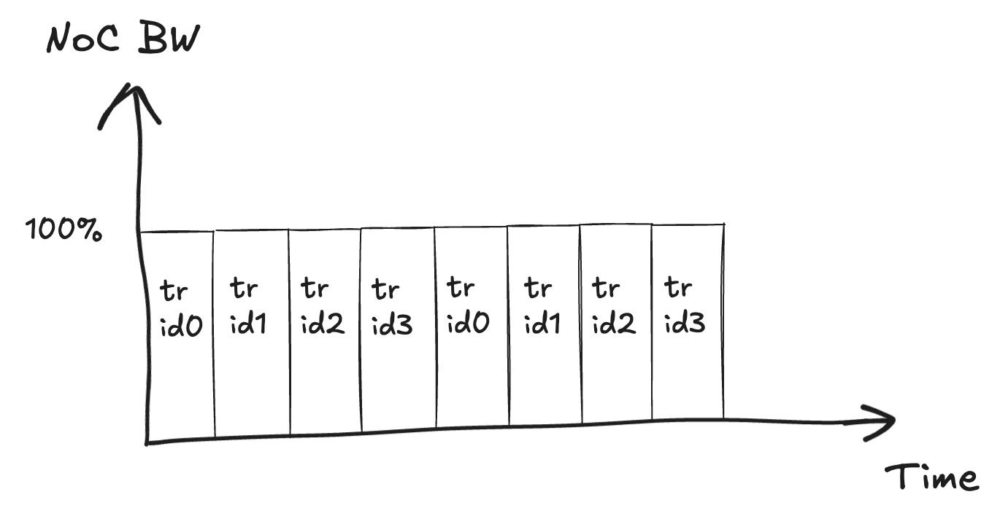

This is how the timeline will look from the ops perspective:

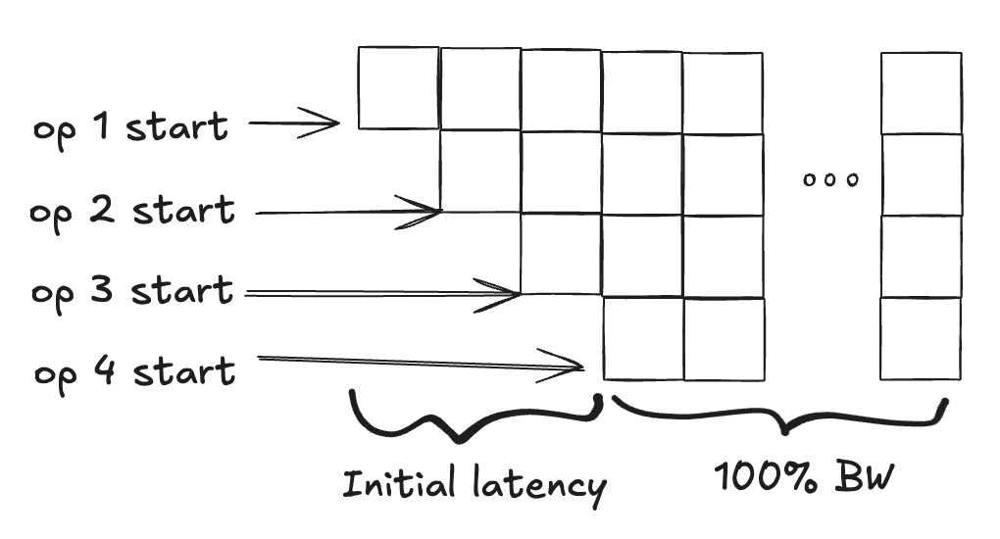

If we were to use only 2 transaction IDs here, we would get the same BW later, but we would have larger initial latency. This is because, now, we are issuing two transactions at a time with one transaction ID.

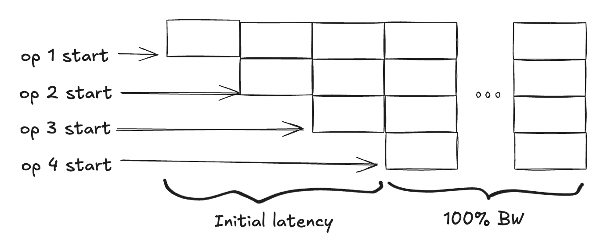

It is essential to keep in mind that if you have sufficient buffer space, 2 transaction IDs will get you 100% BW. The following plots were created with a limited buffer size. This is the most common scenario in which the available space in L1 bounds the kernel writer. Additionally, the amount of data transferred along every vertical line in the plots is the same and equals the buffer size multiplied by 128\.

### Wormhole plots

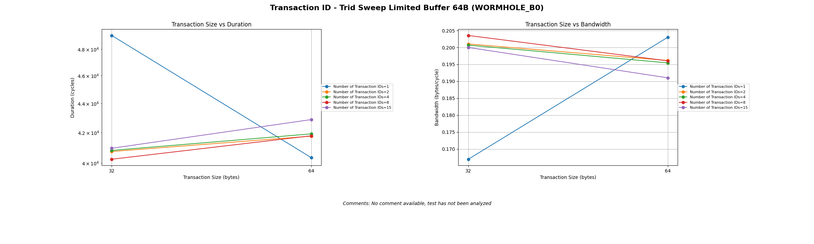

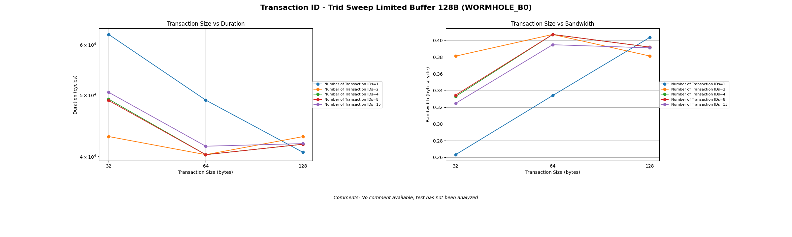

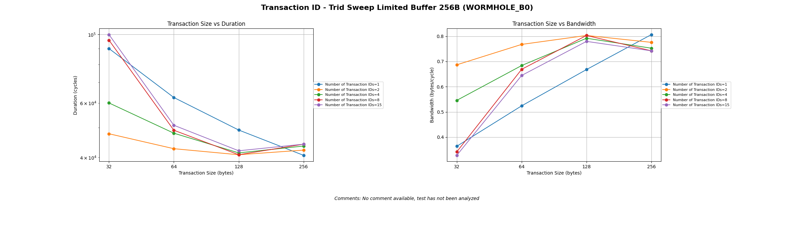

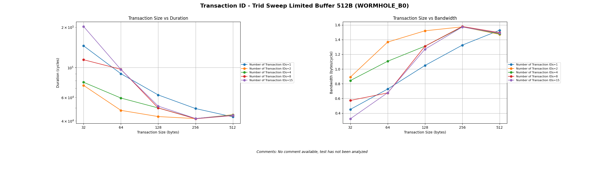

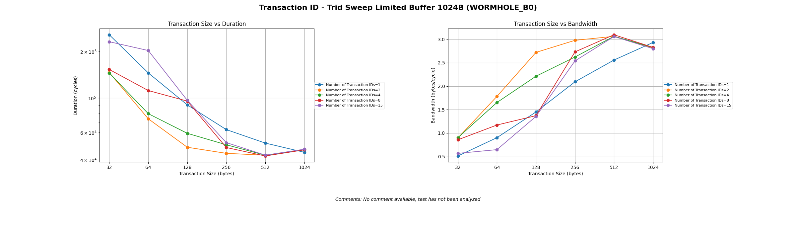

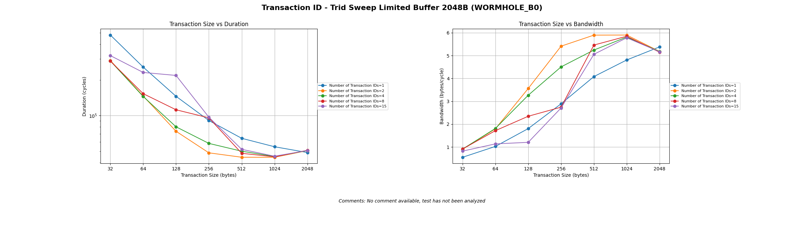

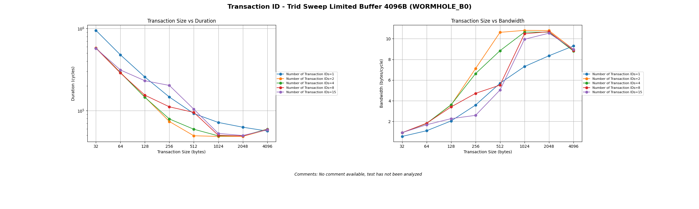

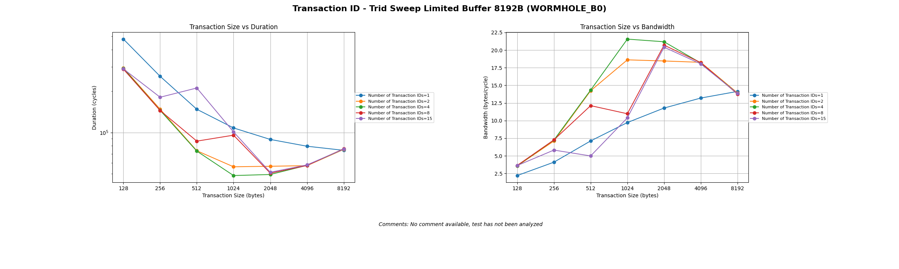

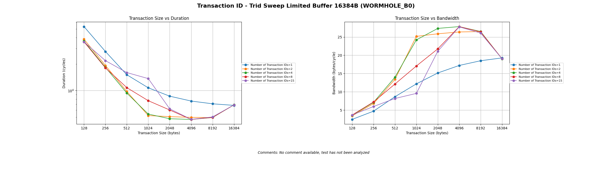

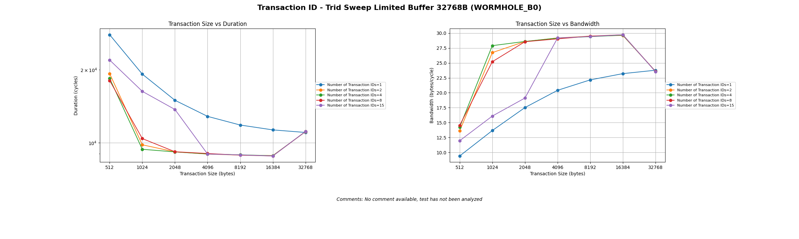

From the previous plots, we can see that under 512B available buffer size, we see no benefit in using transaction IDs. This is because the cost of issuing a transaction under 256B is too high compared to the NoC transaction time.

### Reads and Writes

An example from a kernel and its corresponding performance plot from the transaction ID data movement tests are shown below:
```cpp
uint32_t tmp_local_addr = l1_local_addr;
for (uint32_t i = 1; i <= num_of_transactions; i++) {
    noc_async_read_set_trid(i);
    noc_async_read(sub1_src_noc_addr, tmp_local_addr, bytes_per_transaction);
    tmp_local_addr += bytes_per_transaction;
    sub1_src_noc_addr += bytes_per_transaction;
}

tmp_local_addr = l1_local_addr;
for (uint32_t i = 1; i <= num_of_transactions; i++) {
    noc_async_read_barrier_with_trid(i);
    noc_async_write(tmp_local_addr, sub0_dst_noc_addr, bytes_per_transaction);
    tmp_local_addr += bytes_per_transaction;
    sub0_dst_noc_addr += bytes_per_transaction;
}
noc_async_write_barrier();
```
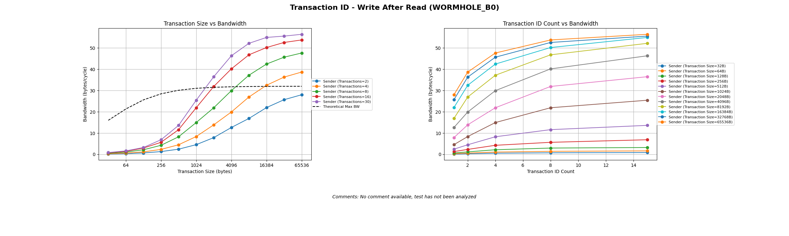

The test issues reads on transaction IDs, and when a read has been completed (i.e. the trid barrier finishes), that data is written out. This write-after-read implementation appears to yield between 1.5x and 2x the theoretical bandwidth. This is because the NIU has an input and output port. We have a core that is sending and receiving data at the same time, with packets circulating around the torus. One read is issued on each transaction ID; the more trids used in this test (i.e. the more transactions issued), the higher the NOC utilization and performance. Since there is data going in and data going out of the core at the same time, the bandwidth calculation for that core is doubled. This does not happen in Read After Write tests because the read requests get stuck behind the larger write requests.
